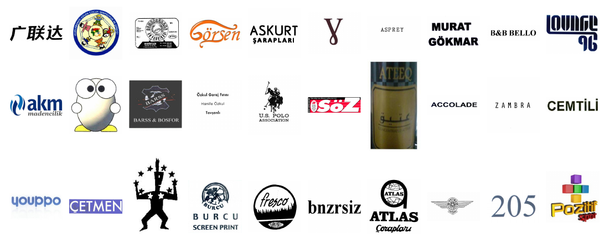

# METU TRADEMARK DATASET

## Introduction

The METU Trademark Dataset is a large dataset (the largest publicly available logo dataset as of 2014, and the largest one not requiring any preprocessing as of 2017), which is composed of more than 900K real logos belonging to real companies worldwide. The dataset also includes query sets of varying difficulties, allowing Trademark Retrieval researchers to benchmark their methods against other methods to progress the field.

## Trademark Dataset

The Dataset (v2) includes 923,343 logo images of different types: text only logos, figure only logos and text+figure combined logos. See Figure 1 for samples.

## Query Set
Our dataset includes very challenging queries that existing Computer Vision, Pattern Recognition and Image Retrieval methodologies have difficulties with (study is ongoing).See [query_set](images/query_set_v2.pdf) for some sample queries and similarities that are expected to be discovered.

### Table 1: Details of METU dataset (v2).
|Aspect|Value|
|--- |--- |
|trademarks|923,343|
|unique register firms|409,675|
|unique trademarks|687,842|
|trademarks containing text only|583,715|
|trademarks containing figure only|19,214|
|trademarks containing figure and text|310,804|
|other trademarks|9,610|
|image format|JPEG|
|Max Resolution|1800x1800 pixels|
|Min Resolution|30x30 pixels|

## Why Another Dataset?

The literature already has a few logo datasets: [MPEG 7 Shape Matching Dataset](http://www.dabi.temple.edu/~shape/MPEG7/index.html), [UMD Logo Dataset](http://lampsrv02.umiacs.umd.edu/projdb/project.php?id=47), [UMD Logo Dataset](http://lampsrv02.umiacs.umd.edu/projdb/project.php?id=47) , [Tobacco800 Document Image Database](http://www.umiacs.umd.edu/~zhugy/tobacco800.html) . Although these datasets have been very useful in logo retrieval and matching studies, they are limited in the number of images and the types of queries that can be performed - see Table 2. Therefore, to be able to advance the logo retrieval field, a challenging large dataset is required, and we hope that METU Dataset will fill in this gap.

### Table 2: Comparison of existing logo datasets.

|Logo dataset|Number of images|
|--- |--- |
|MPEG 7 Shape Matching Dataset|1,400|
|UMD Logo Dataset|106|
|BelgaLogos Dataset|10,000|
|Tobacco800 Document Image Database|1,290|
|METU Dataset (This set)|923,343|

## Download Instructions

For the time being, the dataset is available per request only. If you are a researcher at a university (or a graduate student) interested in the dataset for research purposes, please contact Sinan Kalkan with your intention.

**This material is presented to ensure timely dissemination of scholarly and technical work. Copyright and all rights therein are retained by authors or by other copyright holders. All persons copying this information are expected to adhere to the terms and constraints invoked by each author's copyright. In most cases, these works may not be reposted without the explicit permission of the copyright holder.**

## Citation

Please cite the following papers if you use this dataset:  

W. Tuerxun, S. Kalkan, "A Challenging Big Dataset for Benchmarking Trademark Retrieval", 14th IAPR Conference on Machine Vision and Applications, Tokyo, 2015. (Available as a [PDF](http://ceng.metu.edu.tr/~skalkan/publications/MVA15_0154_MS.pdf) file).

O. Tursun, C. Aker, S. Kalkan, "A Large-scale Dataset and Benchmark for Similar Trademark Retrieval", submitted (Available at [arXiv:1701.05766](https://arxiv.org/abs/1701.05766)).

### Acknowledgements

This work is partially funded by the Ministry of Science, Turkey, under the project SANTEZ-0029.STZ.2013-1\. We would like to thank [Usta Bilgi Sistemleri A.Ş.](http://www.usta.com.tr/) and [Grup Ofis Marka Patent A.Ş.](http://www.grupofis.com.tr)for their contributions to the project, by especially making the dataset available for us and the whole community.  

### Contacts

*   [Sinan Kalkan](http://www.ceng.metu.edu.tr/~skalkan/) - Email: [skalkan [at] ceng.metu.edu.tr]
*   [Osman Tursun](https://neouyghur.github.io/)

Please contact Prof. Kalkan for accesing the dataset. For technical problem, please raise issue. We welcome your contributions. Thanks.
